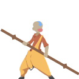
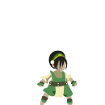

<table>
    <tr>
        <td>
            <strong>Avatar</strong>
        </td>
        <td>
            
            
             
            <em>* Toph is provided as a custom sprite, instead of a Dustkid skin.</em>
        </td>
    </tr>
    <tr>
        <td>
            <strong>Galaxy</strong>
        </td>
        <td>
            
            
        </td>
    </tr>
</table>